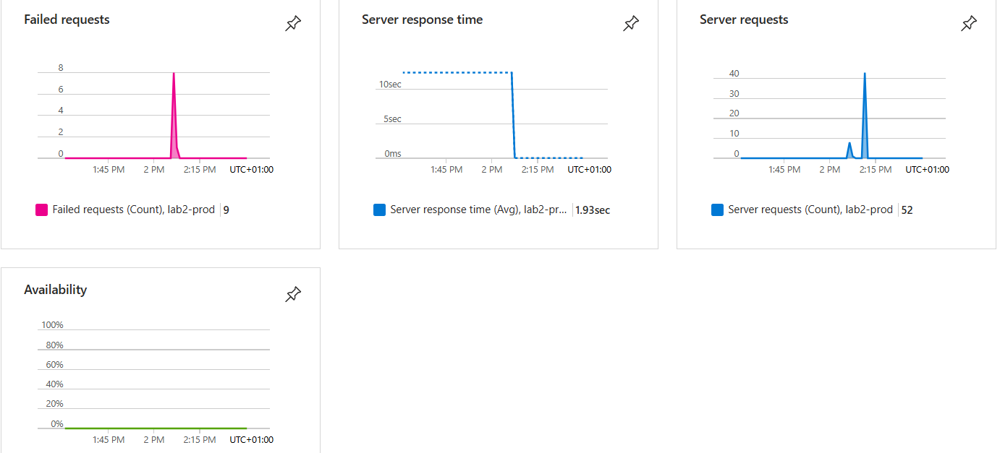

# Lab 2

This folder contains the results of lab 2.

## Development Environment

If a commit is made on the development branch the app will be deployed to the development environment if the test cases have passed.
The development site can be found under: https://green-moss-0d7a25803.5.azurestaticapps.net/

## Production Environment
If a commit is made on the main brancht the app will be deployed to the production environmnet if the test cases have passed.
The production site can be found under: https://green-moss-0d7a25803.5.azurestaticapps.net/

## Insights

The production evnironment is monitored using Application insights. A screenshot below shows insights after the button on the page has been clicked a couple of times.

# Create Release

if you want to publish a new release you first need to merge your changes into the release branch. There you need to to check you changes in the development environment.

Once the manual tests have been done a pull request to the main branch needs to be made.

If all test cases pass you can then merge the pull request.