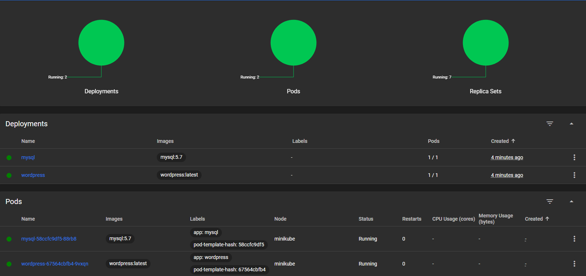
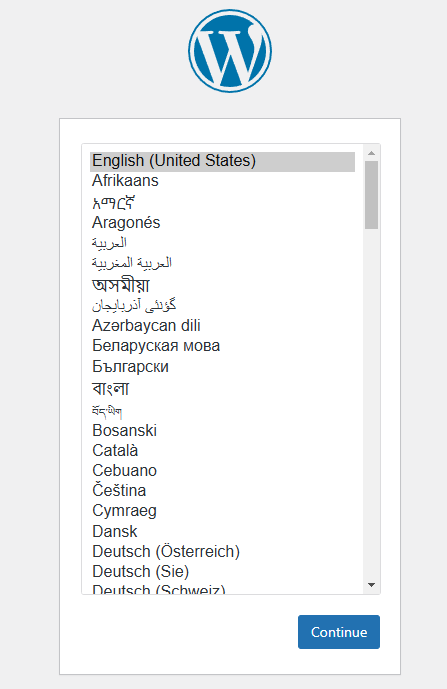

# Wordpress with MySQL on AKS (Minikube)

This project shows how to deploy wordpress with mysql on a kubernetes cluster (based on Minikube).

# Prerequisites

The run this example you need to following tool setup:

 * [Minikube](https://minikube.sigs.k8s.io/docs/start/?arch=%2Fwindows%2Fx86-64%2Fstable%2F.exe+download)
 * [kubectl](https://kubernetes.io/docs/tasks/tools/install-kubectl-windows/)

# Project Structure

This project is divided into two parts. The first contains the deployemtn and service manifests for mysql (Found in the mysql folder) and the second contains the same within the wordpress folder.

# Try it out yourself

To deploy the manifests run this command:

```bash
kubectl -f . -R
```

This command will apply all the manifests within this directory and apply them. Kubernetes will den deploy the containers and the services. If you have the minikube dashboard installed you can checkout the status that should look something like this:



To get access to the wordpress deployment you need to run the following command:

```bash
minikube service wordpress --url
```

This will print out a url that you can copy and paste to get to the wordpress configuration site:

